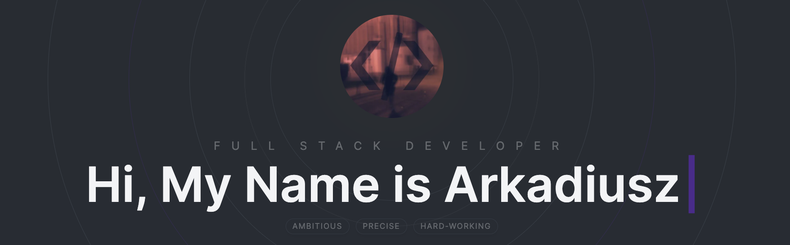

## Project Overview

This project is my personal website portfolio. It was built using Next.js, TypeScript, Tailwind CSS, Sanity and all my heart. It was a fantastic opportunity for me to delve into the basics of Next.js, TypeScript and Sanity(CMS). I enjoyed the process and will be using these technologies more often in the future. I would love to hear any feedback on this project, and if there is any, please contact me!

## Features

- ISG - Incremental Static Generation
- PWA friendly
- Content Management System 
- Light mode / Dark mode

## Tech Stack

- **Next.js**
- **TypeScript**
- **React**
- **Tailwind CSS**
- **Framer Motion**
- **Sanity**
- **Swiper**
- **React Hook Form**
- **Context API**
- and many more...

## Optimization

## Live

https://www.arc4dev.me
